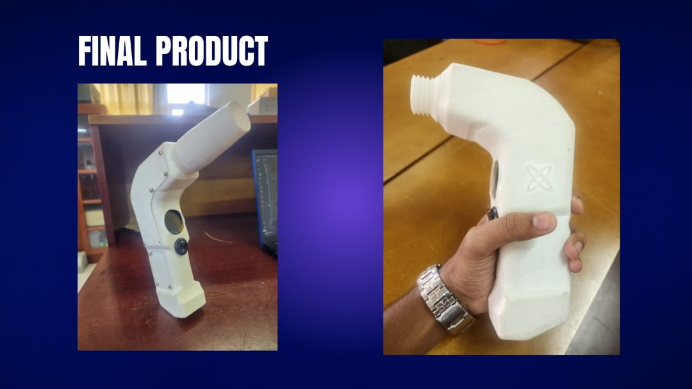
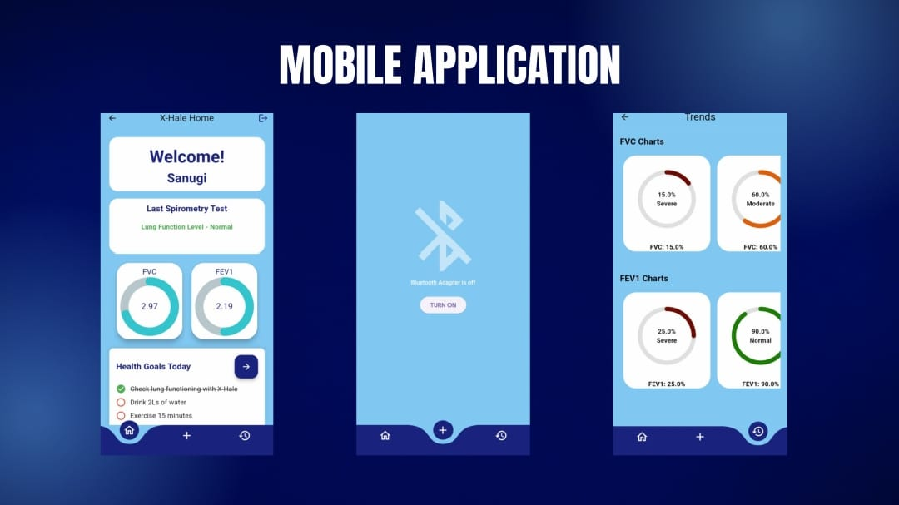

# 🌬️ H-Hale: Smart Portable Digital Spirometer

> Empowering respiratory health monitoring — anytime, anywhere.

---

## 📌 Problem

Respiratory diseases such as Asthma, COPD, and Pulmonary Fibrosis are among the top 10 leading causes of death in Sri Lanka. In 2020 alone, Asthma-related deaths in Sri Lanka reached **6,471**, accounting for **5.57%** of total deaths. Despite the critical need for respiratory monitoring, **digital spirometers are rare**, expensive, and confined to premium healthcare facilities.

Most government hospitals still rely on outdated **manual spirometers** — they’re bulky, less accurate, and not user-friendly. There is a clear gap in **accessible, accurate, and portable** respiratory monitoring tools.

---

## 🎯 Our Goal

To develop an **affordable**, **portable**, and **easy-to-use** smart digital spirometer that allows individuals — whether patients, athletes, or health-conscious users — to monitor lung function **anytime, anywhere**, and share data easily with medical professionals.

---

## 💡 Solution

We designed a **Smart Portable Spirometer** that offers:

- 📱 **Real-time feedback** via a connected mobile app  
- 📊 **Accurate readings** personalized by age, gender, height, weight, and race  
- 🧠 **Automatic computation** of critical respiratory parameters:
  - FVC (Forced Vital Capacity)
  - FEV1 (Forced Expiratory Volume in 1 second)
  - FEV1/FVC Ratio  
- 📈 **Historical tracking** and visual reports  
- 🌐 **Data sharing with doctors** via the app  

---

## ⚙️ How It Works

1. **User blows air** into the device.
2. The airflow passes through a tube where a **velocity sensor** captures the flow speed.
3. Using the equation `Q = A × V` (Flow rate = Area × Velocity), we calculate the flow rate.
4. The app processes this to compute:
   - FVC
   - FEV1
   - FEV1/FVC ratio
5. Data is displayed and stored in the app for user review or sharing.

> 💡 We used a **special tube design** to maintain consistent velocity across the section for more reliable readings.

---

## 📱 Mobile App Features

- Real-time spirometry readings
- Lung function history and trends
- Report generation
- Data export & doctor sharing functionality

---

## 🧪 Applications

- Individuals with Asthma, COPD, or Pulmonary Fibrosis  
- Athletes monitoring respiratory performance  
- Singers and wind instrument players optimizing lung capacity  
- General users interested in proactive lung health management  

---

## 📊 Market Opportunity

With air pollution on the rise and respiratory diseases becoming increasingly common, the demand for **affordable and portable respiratory health monitoring** devices is greater than ever.

Our device offers:

- ✅ Lower cost than existing digital alternatives  
- ✅ Portability and ease of use  
- ✅ Personalization and long-term monitoring  

---

## 📸 Gallery

### 💻 Final Product

### 📱 App Interface

---

## 🚀 Future Plans

- Integration with cloud-based EMR systems  
- AI-powered early detection alerts  
- Integration with wearable health monitoring systems  

---

